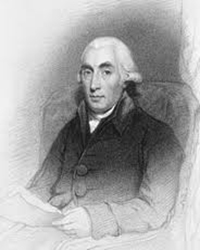
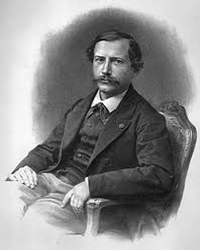
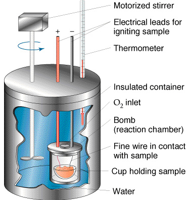
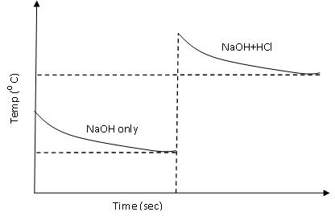

### Introduction

  

 

Chemical reactions usually accompany the formation and absorption of energy in the form of heat. The branch of chemical science dealing with the study of heat and energy changes is known as thermodynamics. The heat changes within a specific system can be studied using the device calorimeter.
 
Calorimetry is derived from the Latin term “calor” which means heat, and the Greek term “metry” means to measure, the heat in the system. The recent advances in the calorimetry and electronics help the user to maintain the samples under proper conditions that can be easily analysed.
 
The Scottish physician Joseph Black, was the first to recognise the distinction between heat and temperature, and is said to be the “Founder of Calorimetry”. It is noted that the credits for modern techniques of calorimetry is given to French chemist Pierre Eugene Berthelot (1827-1907). He studied the problems associated with the heat measurement and constructed the first modern calorimeter. The terms endothermic and exothermic reactions were invented to describe heat reactions and  are also his contributions to chemistry.

Joseph Black

 Pierre Eugene Berthelot

## Theory:
 
 
Generally the reactions taking place in the chemical sciences are breaking and making of chemical bonds. This is accompanied by some heat effects. Formation of chemical bonds releases energy in the form of heat and hence known as an exothermic reaction. The reaction which is accompanied absorption of heat is known as endothermic reaction. Calorimetry is a scientific term dealing with the changes in energy of the system by measuring the heat exchanged with the surroundings. In a broader sense it is defined to determine the heat released or absorbed in a chemical reaction. A calorimeter is a device designed to measure heat of reaction or physical changes and heat capacity. The device can be sophisticated and expensive or simple and cheap.
 
A calorimeter consists of two vessels, outer vessel and an inner vessel. The space between these vessels acts as a heat insulator and hence there is very little heat exchange in between the inner and outer vessels. Thermometer measures the temperature of the liquid in the inner vessel. The stirrer functions in such a way to stir the liquid to distribute the heat in the entire vessel. The fibre rings in the calorimeter helps to hold the inner vessel hanging in the center of the outer vessel. It also has an insulating cover or lid with holes for attaching the stirring rod and thermometer.

 

### A brief overview of Calorimetric reactions:
 
 
A calorimeter contains water or other substances with known heat capacity. The heat, denoted as ( $Q$ ) released by a reaction or process is absorbed by the calorimeter and any substances in the calorimeter. If the only other substance in the calorimeter is water, the following energy balance exists:

$$Q=Q_{cal}+Q_W$$

$Q_{cal}$ The heat flow for the calorimeter. 
$Q_W$ The heat flow for the water. 

The individual heat flow rate can be directly related to the heat capacity and temperature change for the substance. This can be denoted by the equation

$$Q_{cal}=C_{cal}\Delta T$$

$$Q_W=C_W\Delta T$$

$C_{cal}$ The heat capacity of the calorimeter. 
$C_W$  The heat capacity of the water.

Since the water and calorimeter are in thermal equilibrium they exhibit same $\Delta T$ value. 

The energy change of a reaction that occurs at contant pressure is termed as the enthalpy change or the heat of reaction.
 
The heat capacity, which is defined as the amount of heat required to raise the temperature of a given quantity of a substance by one degree Celsius,( unit is J/ 0 C) of the entire system, denoted by $C$ , is represented as the sum of the heat capacities for the individual components involved in the reaction process.

$$C=C_{cal}+C_W$$

Note: Since the calorimeter is insulated there is no heat exchange with the surroundings. This can be shown as:

$$Q_{\text{reaction}}=-Q_{\text{calorimeter}}$$

t is noted that the calorimeter exists as a fixed unit and thus its heat capacity is also thought to be having a fixed value. In some cases, where the amount of substance is varying, an intensive measurement of heat capacity, specific heat capacity is employed to study the reactions. Specific heat capacity is defined as the heat required for raising unit mass of substance by one degree of temperature. It has the units J/g0 C.

The relation between the heat capacity and specific heat of a substance is denoted as $C=ms$.

$m$ mass of substance in grams. 
$C$ Heat capacity. 
$s$ specific heat 

The magnitude of these heat effects depends on the following parameters:
1. Pressure.
2. Temperature.
3. Physical state of the reactants and the products.
4. Amount of substance involved in the reaction.
 
Depending on the nature of the reactions, different names are given to the heat of reactions, discussed in detail in the following sections.
 
 
 ### 1.      Heat of Formation:
 
It is defined as the amount of heat evolved or absorbed during the formation of one mole of a substance from its component elements.
 
### 2.      Heat of hydration:
 
The formation of a solution involves the interaction of solute with solvent molecules. Many different liquids can be used as solvents to dilute the solute to form for liquid solutions. Water is the most commonly used solvent. When water is used as the solvent, the dissolving process is called **hydration**. The enthalpy change associated the hydration process is called the heat of hydration. Enthalpy of hydration of an ion is the amount of energy released when a mole of the ion dissolves in a large amount of water forming an infinite dilute solution in a specific process. Apart from the thermal energies resulting from the chemical reactions many physical processes including the ice melting or the vapour condensation is accompanied by the absorption or release of heat. Such physical processes are classified into two types: Heat of solution and Heat of dilution.
 
### 3.      Heat of Solution:
 
The heat of solution or enthalpy of solution is defined as the heat generated or absorbed when a certain amount of the solute dissolves in a certain amount of solvent.

$$NaCl(s)\longrightarrow NA^++Cl^-(aq)$$

### 4.      Heat of Dilution:
 
It is noted that certain heat effects take place when a solution of a given concentration is diluted to another one. That is when more solvent is added to lower the overall concentration of the solute in the previously prepared solution; additional heat is given off or absorbed. The heat of dilution is defined as the heat change that is associated with the dilution process. For an infinitely diluted solution the heat of dilution is noted as zero.
 
### 5.      Heat of Combustion:
 
It is the amount of heat evolved when 1 g molecule of it is completely oxidised. That is the amount of energy released when a given compound undergoes complete combustion with oxygen under standard conditions. The chemical reaction is hydrocarbons reacting with oxygen to form $CO_2$, $H_2O$ and heat.
 
### 6.      Heat of Neutralisation:
 
The heat of neutralisation of an acid is defined as the amount of heat evolved when one equivalent of an acid and one equivalent of a base undergo a neutralisation reaction to form water and a salt. Similarly the heat of neutralisation of a base is the amount of heat evolved when 1 g equivalent of the base is completely neutralised by a strong acid in a dilute solution.

$$HA+BOH \rightleftharpoons  AB+H_2O+\text{57.3KJ}$$
$$\text{Or}$$
$$H^++A^-+B^++OH^- \rightleftharpoons A^++B^++H_2O+\text{57.3KJ}$$

## Types of calorimeter:
 
### 1.      Bomb Calorimeter
 
The heat of combustion of a compound is measured by placing a known mass of a compound in a steel container called a constant-volume bomb calorimeter, which is filled with oxygen at about 30 atm pressure. This closed bomb is immersed in a known amount of water. Sample is added in the sample cup and it is electrically ignited. The heat produced by the combustion reaction is calculated by recording the rise in temperature of the water.

### 2.      Coffee cup calorimeter
 
A constant- pressure calorimeter measures the heat effects of variety of reactions such as neutralisation reactions, heat of solution and heat of dilutions. A coffee cup calorimeter is basically constructed from a polystyrene (Styrofoam) cup with a lid, in which, the cup is filled with a known amount of water and a thermometer inserted measures the heat changes associated with the reaction.

## Determination of Heat of Neutralisation of a Strong acid by Strong base
## Principle:
 
 A known volume of HCl solution of exactly known concentration is allowed to react with a strong alkali in dilute solution. The temperature change is then noted. With the known volume of HCl solution, the heat of neutralisation can be calculated. It is the amount of heat evolved when V cm3 of HCl solution of concentration C g/litre equilibrium dcm-1 is neutralised completely. 

Thus,

$$\text{Heat of neutralisation}=(1000\times Q)/(V \times C)$$

$$Q=(50+W)(T_3-T_1)+50(T_3-T_2)$$

Where,
$Q$ The amount of heat gained (cal). 
$V$ The volume of acid (cm3). 
$C$ The concentration of acid (g/L).

### Important steps to follow:
 
1. 50mL each of 1N solution of NaOH and HCl are prepared.
2. 50mL of NaOH is pipette out into a calorimeter.
3. Temperature is noted at half minute interval, till it becomes steady.
4. Then add 50mL acid and its initial temperature is noted previously.
5. Temperature of the mixture is noted till it becomes steady.
6. A graph is plotted with temperature against time. The final temperature is obtained from the graph (Fig.2).

Figure 2: Heat of Neutralisation

 
